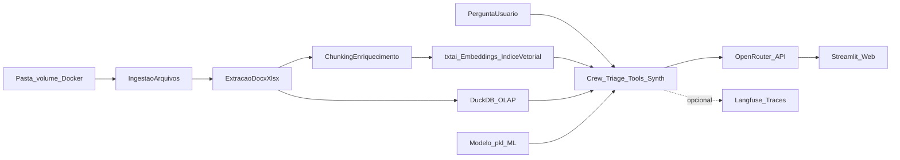

# Playbook Executável do MVP Biotech

## Progresso registrado (rastreio)

Registro factual do que já existe no repositório. A stack **evoluiu em maio/2026**: geração de texto saiu do **LM Studio no host** para **OpenRouter remoto** (dados e índices continuam locais em volume). Atualizar este bloco a cada marco entregue.

**Última sincronização:** 2026-05-27 (OpenRouter + crew único + Langfuse + ML no chat).

| Marco | Estado | Evidência no código / artefatos |
|--------|--------|----------------------------------|
| Runtime Docker + Compose | Entregue | `docker-compose.yml`, `docker/streamlit/Dockerfile`, volumes `/data/projetos` (bind RO), `/data/txtai`, `/data/duckdb`, `/data/ml`, `/data/sqlite`, `restart: unless-stopped`, `PYTHONUNBUFFERED` |
| HEALTHCHECK da imagem | Entregue | `Dockerfile`: GET HTTP `/_stcore/health` na porta do Streamlit (8502) |
| UI Streamlit (layout + abas) | Entregue | `apps/streamlit/app.py`: **Conversa**, **Documentos**, **ML tradicional**, **Desenvolvimento** (sub-abas: visão, parâmetros do chat, RAG, índice, OLAP, diagnóstico) |
| Inventário segmentado por projeto | Entregue | `apps/streamlit/projects_loader.py`: um subdiretório de primeiro nível = um `project_id`; varredura recursiva; hash SHA-256 opcional no scan; tolerância a `OSError`; `filter_scans_by_extensions` evita re-scan para OLAP |
| Parsing documental (docx, planilhas, etc.) | Entregue | `apps/streamlit/rag/extract.py`: `.docx`, `.xlsx`, `.xlsm`, `.pdf`, `.txt`, `.md`, `.csv` |
| Pipeline txtai (chunking + índice + busca) | Entregue | `apps/streamlit/rag/chunking.py`, `rag/index_txtai.py`, `rag/paths.py`; modelo `sentence-transformers/paraphrase-multilingual-mpnet-base-v2`; persistência em `/data/txtai`; filtro opcional por `project_id` |
| Chat + RAG + LLM remoto | Entregue | `app.py` + `agents/`: cliente OpenAI cacheado → **OpenRouter** (`llm_config.py`); perfis Qwen3.5 (`qwen35_inference.py`); streaming sem flash de `<think>`; filtro RAG por projeto |
| Reindexação incremental por hash de arquivo | Entregue | `rag/manifest.json` + `build_index` incremental: compara SHA-256, `delete` de chunks obsoletos, `upsert` só em arquivos novos/alterados/removidos |
| DuckDB / OLAP na UI | Entregue | `apps/streamlit/olap/`: ingestão CSV/XLSX/XLSM → DuckDB; catálogo; NL→SQL read-only (`nl_query.py`); demo opcional; sync automático no escaneamento; salvaguarda contra drop em scan vazio |
| ML tradicional (FLAML) na UI | Entregue | `apps/streamlit/ml/`: **AbRank (Kaggle)** via `kagglehub`, regressão `log_Aff`, catálogo YAML, FLAML, `.pkl`, predição em lote; embeddings ESM-2 (`sequence_embeddings.py`) |
| ML no chat (Tool do crew) | Entregue | `ml/chat_infer.py` + `agents/tools.py`: extração estruturada de features + predição com `.pkl` configurado em `ASSISTENTE_ML_CHAT_MODEL` |
| Roteamento chat (docs / planilhas / ML) | Entregue | `agents/triage.py` + `agents/intent_rules.py` (substituiu `chat_router.py`, aposentado em 2026-05) |
| Sistema multiagentes (crew custom) | Entregue | `apps/streamlit/agents/`: Greeter rule-based → Triage → Tools (RAG/OLAP/ML em paralelo) → Synthesizer; **único caminho do chat** (sem `USE_CREWAI`); `HandoffTrace` em expander dev; `AGENTS.md` |
| Observabilidade LLM (Langfuse) | Entregue (MVP) | `apps/streamlit/observability/`: wrapper OpenAI, trace `chat-turn`, spans `crew-pipeline` / Tools, gerações nomeadas (`crew-triage`, `crew-synthesizer`, `olap-nl-to-sql`, `ml-feature-extract`); `session_id` Streamlit; vars no Compose + `.env.docker.example` |
| Metadados / auditoria (SQLite ou Postgres) | Pendente | Volume `/data/sqlite` no Compose; sem schema, migrações ou trilha no código |
| Autenticação web | Pendente | Conforme Fase 1 |
| RBAC, guardrails, testes integrados E2E | Pendente | Conforme Fase 4 |
| Suíte de testes unitários | Parcial | `apps/streamlit/tests/` — **~155** testes (RAG, OLAP, ML/AbRank, crew, intent_rules, Qwen3.5, Langfuse, ingest); sem E2E Compose |

**Porta do Streamlit (MVP atual):** `8502` (host e contêiner), configurável por `STREAMLIT_PORT` no `.env` do Compose.

### Decisões de evolução (registro)

| Data | Decisão | Motivo |
|------|---------|--------|
| 2026-05 | LLM: **LM Studio (host)** → **OpenRouter (remoto)** | Reduz carga de GPU/RAM local; uma chave, vários modelos (`openrouter/free`, Qwen3.5, etc.) |
| 2026-05 | `chat_router.py` aposentado → **pipeline multiagente** | Triage + Tools + Synthesizer; regras em `intent_rules.py` |
| 2026-05 | **`USE_CREWAI` removida** | Crew custom é o único caminho; `agents/llm.py` reservado para agentes CrewAI futuros |
| 2026-05 | **Langfuse** integrado (opcional) | Observabilidade de prompts, tokens, latência e sessões de chat |

### Situação por fase (estimativa, escopo funcional inalterado)

| Fase | Progresso | Observação |
|------|-----------|------------|
| 0 — Preparação | ~100% | Stack e paths de volume definidos; `README.md` documenta OpenRouter + Langfuse |
| 1 — Fundação | ~85% | Docker, UI, diagnóstico (OpenRouter + Langfuse), chat, DuckDB + ingestão OLAP ok; faltam SQLite/auditoria, auth |
| 2 — Ingestão e parsing | ~85% | Scan + parsers + stats na indexação + sync DuckDB; falta página dedicada de status por arquivo |
| 3 — RAG local + chat | ~90% | Fluxo escanear → indexar → buscar → chat com crew; NL→SQL e ML no chat; critério >90% citações curadas ainda em aberto |
| 4 — Segurança | ~5% | Langfuse cobre observabilidade básica; RBAC/auth/guardrails/E2E pendentes |

**Demo atual possível:** escanear projetos → atualizar base (RAG) → **Conversa** (crew roteia docs/planilhas/ML automaticamente) → **ML tradicional** (treino + `.pkl` + predição) → **Desenvolvimento** (tuning, trilha do crew, diagnóstico OpenRouter/Langfuse). **Uso interno “seguro” do playbook** ainda exige Fase 1 (login, auditoria) e Fase 4.

**`apps/api` (FastAPI):** opcional, fora do caminho crítico do MVP (desacoplada; ver `logs/correcoes/2026-05-22-revisao-codigo.md`).

## Objetivo

Construir uma **aplicação web** (não desktop), **containerizada em Docker**, para análise documental (`docx`, `xlsx`, `xlsm`) com **RAG local**, **OLAP** e chat com citações, iniciando simples e evoluindo com segurança. Dados sensíveis e índices ficam **locais em volume**; a **geração de texto** usa API remota **OpenRouter** (OpenAI-compatível), reduzindo dependência de GPU no host.

## Escopo de execução (v1 — estado atual)

- **Deploy**: stack MVP em **Docker** (`Dockerfile` + `docker-compose.yml`), com **volumes** para ingestão, índice txtai, DuckDB, ML e SQLite futuro.
- **Framework principal (UI + orquestração)**: **`Streamlit`** — abas Conversa, Documentos, ML tradicional, Desenvolvimento.
- **Pipeline RAG, embeddings e banco vetorial**: **`txtai`** — embeddings locais, persistência do índice e retrieval (sem Qdrant separado no MVP).
- **OLAP**: **`DuckDB`** em volume; NL→SQL read-only; ingestão de planilhas no escaneamento.
- **IA (geração) — estado atual**: **`OpenRouter`** — API compatível com OpenAI (`https://openrouter.ai/api/v1`); chave `OPENROUTER_API_KEY`.
- **IA (geração) — desenho original do playbook**: LM Studio no host; **substituído** por OpenRouter em maio/2026 (registrar se houver rollback local).
- **Cliente LLM no app**: SDK `openai.OpenAI` com `base_url`/`api_key` via `llm_config.py`.
- **Orquestração do chat**: pipeline **multiagente** (`agents/runner.py`, `agents/crew.py`) — Triage, Tools paralelas, Synthesizer com streaming.
- **Observabilidade LLM (opcional)**: **Langfuse** — traces por turno, sessões Streamlit, spans do crew (`observability/langfuse_client.py`).
- **Variáveis de ambiente (MVP)**: `LLM_BASE_URL`, `LLM_MODEL`, `OPENROUTER_API_KEY`; Langfuse: `LANGFUSE_PUBLIC_KEY`, `LANGFUSE_SECRET_KEY`, `LANGFUSE_BASE_URL`.
- **Embeddings no MVP**: via **txtai** (`paraphrase-multilingual-mpnet-base-v2`); ESM-2 para features de sequência no ML tradicional.
- **Metadados/auditoria**: `PostgreSQL` **ou** `SQLite` em volume — **pendente implementação**.
- **Funcionalidades MVP** (intenção inalterada):
  - ingestão de pasta (volume Docker)
  - extração de conteúdo e metadados
  - indexação incremental
  - chat com resposta citando fonte (+ OLAP + ML quando aplicável)
  - **ML tradicional** na UI: dicionário, FLAML, `.pkl`, predição em lote e via chat
  - **autenticação na web** + auditoria básica — **pendente**

**Nota de arquitetura**: não há obrigatoriedade de **`FastAPI`** no MVP — o Streamlit chama Python direto.

## OpenRouter + Langfuse — checklist operacional (MVP atual)

- Garantir **`OPENROUTER_API_KEY`** válida no `.env` antes de testar chat ou RAG ponta a ponta.
- **Desenvolvimento → Diagnóstico**: testar **GET /v1/models** (timeout 5s); verificar status Langfuse quando chaves configuradas.
- Tratar o OpenRouter como **dependência externa**: timeouts (`LLM_TIMEOUT_S`) sem derrubar o app; em CI, mock ou flag para não depender de rede.
- **Langfuse (opcional)**: chaves em Settings → API Keys; após deploy, validar traces em **Sessions** e hierarquia `chat-turn` → `crew-pipeline` → gerações nomeadas.
- **Segurança**: não commitar `.env`; rotacionar chaves expostas; dados de documentos permanecem no volume local — apenas prompts/respostas vão ao OpenRouter (e ao Langfuse se ativo).

## Fluxo operacional (estado atual)

## Fase 0 - Preparação (2-3 dias)

- Definir baseline técnico e de segurança.
- Entregáveis:
  - decisão da stack final (congelada para MVP): **Docker + Streamlit + txtai + DuckDB + OpenRouter** — **feito** (evolução documentada acima)
  - convenção de versionamento e branches
  - checklist de segurança inicial (segredos via env/compose, volumes) — **parcial** (`.env.docker.example`, volumes; auditoria formal na Fase 4)
  - **OpenRouter**: modelo/slug em `LLM_MODEL`; validar `GET /v1/models` na aba Diagnóstico — **feito** (embeddings do MVP via txtai, não via LLM remoto)
  - convenção de **paths em volume** — **feito** no Compose
- Critério de pronto:
  - arquitetura e escopo v1 aprovados — **atendido**

## Fase 1 - Fundação (Semana 1-2)

- Subir estrutura de projeto e **runtime containerizado**.
- Entregáveis:
  - **`docker-compose.yml`** + **`Dockerfile`** (usuário não-root; porta **8502**) — **feito**
  - app **Streamlit** inicial: layout base, página de **diagnóstico** (paths, OpenRouter, DuckDB, Langfuse) — **feito**
  - fluxo **Streamlit → OpenAI SDK → OpenRouter** (streaming) — **feito** (aba Conversa via crew)
  - **DuckDB** “olá mundo” + ingestão real — **feito**
  - banco de **metadados/auditoria** + migrações — **pendente**
  - log estruturado e trilha de auditoria base — **pendente**
  - **autenticação web** — **pendente**
- Critério de pronto:
  - `docker compose up` sobe a UI; LM/OpenRouter e DuckDB verificáveis no diagnóstico — **parcial** (auth pendente)

## Fase 2 - Ingestão e parsing (Semana 3-4)

- Entregáveis:
  - scanner recursivo — **feito** (`projects_loader.py`)
  - parser docx/xlsx/xlsm (+ pdf, txt, md, csv) — **feito**
  - hash/versionamento — **feito** (SHA-256; manifesto incremental)
  - **página de status por arquivo** — **parcial** (stats na indexação RAG; sem página dedicada)
  - materialização DuckDB na ingestão — **feito** (`olap/ingest.py`)
- Critério de pronto:
  - novos arquivos sem duplicação — **feito**

## Fase 3 - RAG local + chat (Semana 5-6)

- Entregáveis:
  - chunking + txtai + retrieval + citações — **feito**
  - página de chat — **feito** (crew multiagente)
  - NL→SQL OLAP integrado ao chat — **feito**
  - predição ML integrada ao chat — **feito** (`ml/chat_infer.py`)
  - `max_tokens`/thinking/truncagem — **parcial** (parâmetros na aba Desenvolvimento; perfis Qwen3.5)
  - observabilidade básica — **feito** (Langfuse MVP)
- Critério de pronto:
  - >90% respostas com citação válida em casos curados — **pendente**

## Fase 4 - Segurança e estabilidade (Semana 7-8)

- Entregáveis:
  - RBAC (admin/revisor/pesquisador) — **pendente**
  - política de logs de auditoria — **pendente**
  - guardrails prompt injection / resposta sem evidência — **pendente**
  - testes E2E Compose — **pendente**
  - scores de feedback do usuário no Langfuse — **pendente** (helper `record_trace_score` pronto)
- Critério de pronto:
  - uso interno validado + checklist de segurança — **pendente**

## Próximos passos sugeridos (ordem, sem mudar escopo funcional)

1. Fechar **Fase 1**: SQLite + schema mínimo; autenticação web; critério de pronto da fase.
2. Fechar **Fase 2**: página de status de ingestão por arquivo (RAG + OLAP).
3. Fechar **Fase 3**: suíte de casos curados + métrica de citação válida; guardrail quando RAG vazio; feedback 👍/👎 → Langfuse scores.
4. Executar **Fase 4** conforme entregáveis acima.

## Ritmo de execução (cadência)

- Planejamento semanal: definir backlog da semana por prioridade.
- Daily curta: bloqueios e progresso.
- Revisão semanal: demo funcional + métricas (incluir painel Langfuse quando ativo).
- Retrospectiva: ajuste de processo e riscos.

## KPIs do playbook

- Tempo médio de ingestão por documento
- Taxa de reprocessamento incremental correto
- Latência P95 de resposta no chat (via Langfuse quando configurado)
- Taxa de respostas com citação válida
- Custo aproximado por sessão (tokens OpenRouter / Langfuse)
- Número de incidentes de segurança internos

## Gestão de risco

- Qualidade de parsing de planilhas: suíte de arquivos de referência.
- Alucinação: resposta sem fonte deve virar "não encontrado".
- Desempenho local: limitar top-k; monitorar RAM (txtai + Streamlit + ESM-2 no ML).
- **Docker**: não perder índice txtai/DuckDB ao recriar contêiner sem volume.
- **Streamlit**: concorrência single-process — documentar limite do MVP.
- **OpenRouter**: dependência de rede e limites de modelos `:free`; timeouts; custo de tokens.
- **Langfuse**: dados de prompt enviados ao projeto configurado — revisar PII antes de ativar em produção.
- Escopo inchado: NER/NEN avançado e agentes extras fora do MVP imediato.

## Backlog pós-MVP (fase 2)

- ML tradicional: comparativo de experimentos (runs), SHAP/importância
- ~~SQL em linguagem natural com executor read-only~~ — **entregue no MVP** (OLAP Tool)
- NER/NEN com `scispaCy` + ontologias
- Agente "Auditor" (validação de citações antes de responder) — esboço em `AGENTS.md` Fase 4
- Observabilidade avançada: LLM-as-judge, datasets Langfuse, evals contínuas
- Cache de Triage por hash da mensagem (economia de tokens)
- Se escala exigir: **vetor dedicado** (Qdrant) ou **API** (`FastAPI`) separada da UI
