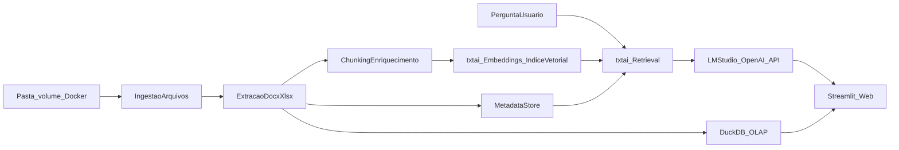

# Playbook Executável do MVP Biotech

## Progresso registrado (rastreio)

Registro factual do que já existe no repositório **sem alterar** a arquitetura-alvo (Docker + Streamlit + txtai + DuckDB + LM Studio no host). Atualizar este bloco a cada marco entregue.

| Marco | Estado | Evidência no código / artefatos |
|--------|--------|----------------------------------|
| Runtime Docker + Compose | Entregue | `docker-compose.yml`, `docker/streamlit/Dockerfile`, volumes `/data/projetos` (bind RO), `/data/txtai`, `/data/duckdb`, `/data/sqlite`, `extra_hosts` para `host.docker.internal`, `restart: unless-stopped`, `PYTHONUNBUFFERED` |
| HEALTHCHECK da imagem | Entregue | `Dockerfile`: GET HTTP `/_stcore/health` na porta do Streamlit (8502) |
| UI Streamlit (abas) | Entregue | `apps/streamlit/app.py`: Início, Fontes e inventário, Indexação RAG (placeholder), Chat (placeholder), OLAP (placeholder), Diagnóstico (runtime + teste GET `/v1/models`) |
| Inventário segmentado por projeto | Entregue | `apps/streamlit/projects_loader.py`: um subdiretório de primeiro nível = um `project_id`; varredura recursiva; hash SHA-256 opcional; tolerância a `OSError` em stat/hash/walk |
| Parsing docx/xlsx, txtai, DuckDB na UI, auth web | Pendente | Conforme Fases 1–4 abaixo |

**Porta do Streamlit (MVP atual):** `8502` (host e contêiner), configurável por `STREAMLIT_PORT` no `.env` do Compose.

## Objetivo
Construir uma **aplicação web** (não desktop), **containerizada em Docker**, para análise documental (`docx`, `xlsx`, `xlsm`) com **RAG local**, **OLAP** e chat com citações, iniciando simples e evoluindo com segurança. O mesmo produto segue **orientado a dados e modelo locais** (pastas montadas em volume, LM Studio no host); a UI e o pipeline rodam no contêiner.

## Escopo de execução (v1)
- **Deploy**: tudo que for “nosso stack de produto MVP” roda em **Docker** (`Dockerfile` + `docker-compose.yml`), com **volumes** para dados de ingestão, índice txtai, arquivos DuckDB e (se aplicável) cache de modelos de embedding.
- **Framework principal (UI + orquestração)**: **`Streamlit`** — páginas/abas para ingestão, status, chat RAG, e consultas/dashboards **OLAP** sobre dados tabulares.
- **Pipeline RAG, embeddings e banco vetorial**: **`txtai`** — embeddings, persistência do índice semântico e recuperação no mesmo ecossistema Python (sem serviço Qdrant separado no MVP).
- **OLAP**: **`DuckDB`** (arquivo `.duckdb` em volume ou views sobre Parquet/CSV gerados na ingestão), consultado a partir do Streamlit com queries parametrizadas (read-only onde fizer sentido).
- **IA local (geração)**: **`LM Studio`** no **host** — API **compatível com OpenAI** (`/v1/chat/completions`, streaming quando o modelo suportar). URL típica: `http://127.0.0.1:1234/v1`.
- **Cliente LLM no app**: SDK/cliente OpenAI no processo Python do Streamlit, com `base_url` apontando para o LM Studio; `api_key` em geral dummy/placeholder, conforme a versão do LM Studio.
- **Variáveis de ambiente (MVP)**: ex. `LLM_BASE_URL` / `OPENAI_BASE_URL` + `LLM_MODEL` (id exatamente como no LM Studio).
- **Rede (contêiner → LM Studio no host)**: no Windows/macOS usar `http://host.docker.internal:1234/v1` a partir do contêiner; no Linux definir na Fase 0 (`extra_hosts`, rede host ou equivalente) e documentar no `README`/compose.
- **Embeddings no MVP**: preferencialmente via **txtai** (modelo de sentence embeddings configurado no pipeline); opcionalmente **`/v1/embeddings` do LM Studio** se quiser centralizar inferência no mesmo servidor gráfico — registrar a escolha na Fase 0.
- **Metadados/auditoria**: `PostgreSQL` **ou** `SQLite` em arquivo em volume (bootstrap simples continua válido; migrations conforme a escolha).
- **Funcionalidades MVP** (inalteradas na intenção):
  - ingestão de pasta (montada como volume no Docker)
  - extração de conteúdo e metadados
  - indexação incremental
  - chat com resposta citando fonte
  - **autenticação na web** + auditoria básica (equivalente ao “login local” do blueprint, adaptado a sessão web)

**Nota de arquitetura**: não há obrigatoriedade de **`FastAPI`** no MVP — o Streamlit chama Python direto. Uma API REST separada só entra no roadmap se surgir necessidade (integrações externas, múltiplos clientes).

## LM Studio — checklist operacional (MVP)
- Garantir **servidor LM Studio ativo** e **modelo de chat carregado** antes de testar chat ou RAG ponta a ponta a partir do contêiner.
- Tratar o LM Studio como **dependência externa ao contêiner**: na UI ou página de diagnóstico, indicador de “LLM alcançável”; em CI, mock ou flag para não depender de GPU/host.
- **Segurança de rede**: não expor LM Studio à internet sem TLS/proxy; restringir bind/interfaces no uso interno. Dados e modelo seguem locais; superfície de rede consciente.

## Fluxo operacional

## Fase 0 - Preparação (2-3 dias)
- Definir baseline técnico e de segurança.
- Entregáveis:
  - decisão da stack final (congelada para MVP): **Docker + Streamlit + txtai + DuckDB + LM Studio (host)**
  - convenção de versionamento e branches
  - checklist de segurança inicial (segredos via env/compose, logs, volumes)
  - **LM Studio**: modelo de chat carregado; URL base e nome do modelo; se embeddings forem pelo LM Studio, validar `POST /v1/embeddings`; validar `GET /v1/models` **de dentro do contêiner** (rede até `host.docker.internal` ou equivalente no Linux).
  - convenção de **paths em volume** (ingestão, índice txtai, `.duckdb`, SQLite de auditoria).
- Critério de pronto:
  - arquitetura e escopo v1 aprovados

## Fase 1 - Fundação (Semana 1-2)
- Subir estrutura de projeto e **runtime containerizado**.
- Entregáveis:
  - **`docker-compose.yml`** + **`Dockerfile`** (imagem enxuta quando possível; usuário não-root; porta Streamlit exposta — no repositório atual: **8502**, via `STREAMLIT_PORT`)
  - app **Streamlit** inicial: layout base, página de **diagnóstico** (versão, paths de volume, teste de conectividade ao LM Studio com timeouts e mensagem clara se indisponível)
  - fluxo mínimo **Streamlit → cliente OpenAI** → LM Studio (`LLM_BASE_URL`, streaming se suportado)
  - **DuckDB** “olá mundo”: conexão a arquivo em volume + uma consulta/agregação de exemplo na UI
  - banco de **metadados/auditoria** inicial + migrações (Postgres ou SQLite em volume)
  - log estruturado e trilha de auditoria base
  - **autenticação web** inicial (equivalente ao login do blueprint: ex. `streamlit-authenticator` ou camada atrás de reverse proxy — escolher e documentar na Fase 0)
- Critério de pronto:
  - `docker compose up` sobe a UI; usuário autentica (ou fluxo definido); LM Studio e DuckDB verificáveis pela interface de diagnóstico

## Fase 2 - Ingestão e parsing (Semana 3-4)
- Implementar pipeline documental (código chamado pelo Streamlit ou módulos importados por ele).
- Entregáveis:
  - scanner de diretório recursivo (path = volume montado)
  - parser de `docx`, `xlsx`, `xlsm`
  - hash/versionamento para detectar alterações
  - **página Streamlit** de status da ingestão (progresso, erros, último hash)
  - (opcional nesta fase) materialização de tabelas/resumos para **DuckDB** a partir da extração (prepara OLAP na Fase 3/4)
- Critério de pronto:
  - novos arquivos entram no pipeline sem duplicação

## Fase 3 - RAG local (Semana 5-6)
- Construir recuperação semântica + chat com **txtai** e geração via **LM Studio**.
- Entregáveis:
  - chunking com metadados de origem (arquivo, aba, seção) compatíveis com o índice txtai
  - **txtai**: embeddings, persistência do índice em volume, pipeline de retrieval + prompt com **citações**
  - **página de chat** no Streamlit consumindo o pipeline (sem necessidade de endpoint REST próprio)
  - temperatura / `max_tokens` / truncagem de contexto alinhados ao modelo no LM Studio e à janela de contexto
- Critério de pronto:
  - respostas com evidência e fonte em >90% dos casos de teste curados

## Fase 4 - Segurança e estabilidade (Semana 7-8)
- Endurecer operação para uso real interno.
- Entregáveis:
  - RBAC simples (admin/revisor/pesquisador), adaptado a **sessão web**
  - política de logs de auditoria
  - guardrails de prompt injection e resposta sem evidência
  - testes de integração ponta a ponta (incluindo subida via Compose e smoke de txtai + DuckDB)
- Critério de pronto:
  - uso interno validado (dados locais em volume, LM Studio no host) + checklist de segurança atendido

## Ritmo de execução (cadência)
- Planejamento semanal: definir backlog da semana por prioridade.
- Daily curta: bloqueios e progresso.
- Revisão semanal: demo funcional + métricas.
- Retrospectiva: ajuste de processo e riscos.

## KPIs do playbook
- Tempo médio de ingestão por documento
- Taxa de reprocessamento incremental correto
- Latência P95 de resposta no chat
- Taxa de respostas com citação válida
- Número de incidentes de segurança internos

## Gestão de risco
- Qualidade de parsing de planilhas: criar suíte de arquivos de referência.
- Alucinação: resposta sem fonte deve virar "não encontrado".
- Desempenho local: limitar top-k e cachear embeddings; monitorar RAM do contêiner (txtai + Streamlit).
- **Docker**: tamanho de imagem e tempo de build; **não** perder índice txtai/DuckDB ao recriar o contêiner sem volume.
- **Streamlit**: modelo de concorrência (um processo Python) — muitos usuários simultâneos podem exigir réplicas/fila em fase posterior; documentar limite do MVP.
- **LM Studio**: processo **fora** do contêiner — “subir modelo antes de testar”; timeouts sem derrubar o app; **VRAM** e janela de contexto vs. prompt RAG (truncar recuperados se necessário).
- Escopo inchado: manter SQL-NL e NER/NEN avançado fora do MVP.

## Backlog pós-MVP (fase 2)
- SQL em linguagem natural com executor read-only
- NER/NEN com `scispaCy` + ontologias
- Multiagentes especializados por etapa de P&D
- Observabilidade avançada e avaliação contínua de qualidade
- Se escala ou requisitos de busca híbrida exigirem: **vetor dedicado** (ex. Qdrant) ou **API** (`FastAPI`) separada da UI, mantendo o mesmo contrato de ingestão e metadados