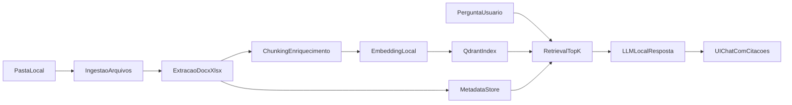

# Playbook Executável do MVP Biotech

## Objetivo
Construir uma aplicação desktop offline-first para análise documental (`docx`, `xlsx`, `xlsm`) com RAG local e chat com citações, iniciando simples e evoluindo com segurança.

## Escopo de execução (v1)
- Desktop: `Tauri + React + TypeScript + Vite`
- Backend local: `Python + FastAPI`
- IA local (geração): `LM Studio` (API compatível com OpenAI em `http://127.0.0.1:1234/v1` por padrão)
- Embeddings: preferência MVP — `SentenceTransformers` no Python (indexação); opcionalmente modelo de embeddings no LM Studio (`/v1/embeddings`) se quiser unificar no mesmo servidor
- Indexação vetorial: `Qdrant`
- Metadados/auditoria: `PostgreSQL` (ou `SQLite` no bootstrap)
- Funcionalidades MVP:
  - ingestão de pasta local
  - extração de conteúdo e metadados
  - indexação incremental
  - chat com resposta citando fonte
  - login local + auditoria básica

## Fluxo operacional

## Fase 0 - Preparação (2-3 dias)
- Definir baseline técnico e de segurança.
- Entregáveis:
  - decisão da stack final (congelada para MVP)
  - convenção de versionamento e branches
  - checklist de segurança inicial (offline, segredos, logs)
- Critério de pronto:
  - arquitetura e escopo v1 aprovados

## Fase 1 - Fundação (Semana 1-2)
- Subir estrutura de projeto e serviços base.
- Entregáveis:
  - app desktop inicial com login local
  - API FastAPI com healthcheck (`/health`) e verificação opcional do LM Studio (`/health/llm`)
  - rota de chat (`POST /chat`) usando cliente OpenAI com `base_url`/`LLM_BASE_URL` apontando para o LM Studio; suporte a streaming (`POST /chat/stream`)
  - banco relacional inicial + migrações
  - log estruturado e trilha de auditoria base
- Critério de pronto:
  - aplicação sobe localmente e autentica usuário

## Fase 2 - Ingestão e parsing (Semana 3-4)
- Implementar pipeline documental.
- Entregáveis:
  - scanner de diretório recursivo
  - parser de `docx`, `xlsx`, `xlsm`
  - hash/versionamento para detectar alterações
  - tela de status da ingestão
- Critério de pronto:
  - novos arquivos entram no pipeline sem duplicação

## Fase 3 - RAG local (Semana 5-6)
- Construir recuperação semântica + chat.
- Entregáveis:
  - chunking com metadados de origem
  - embeddings locais e upsert no Qdrant
  - endpoint de consulta semântica
  - chat com citação de documento/seção
- Critério de pronto:
  - respostas com evidência e fonte em >90% dos casos de teste curados

## Fase 4 - Segurança e estabilidade (Semana 7-8)
- Endurecer operação para uso real interno.
- Entregáveis:
  - RBAC simples (admin/revisor/pesquisador)
  - política de logs de auditoria
  - guardrails de prompt injection e resposta sem evidência
  - testes de integração ponta a ponta
- Critério de pronto:
  - execução offline validada + checklist de segurança atendido

## Ritmo de execução (cadência)
- Planejamento semanal: definir backlog da semana por prioridade.
- Daily curta: bloqueios e progresso.
- Revisão semanal: demo funcional + métricas.
- Retrospectiva: ajuste de processo e riscos.

## KPIs do playbook
- Tempo médio de ingestão por documento
- Taxa de reprocessamento incremental correto
- Latência P95 de resposta no chat
- Taxa de respostas com citação válida
- Número de incidentes de segurança internos

## Gestão de risco
- Qualidade de parsing de planilhas: criar suíte de arquivos de referência.
- Alucinação: resposta sem fonte deve virar "não encontrado".
- Desempenho local: limitar top-k e cachear embeddings.
- Escopo inchado: manter SQL-NL e NER/NEN avançado fora do MVP.

## Backlog pós-MVP (fase 2)
- SQL em linguagem natural com executor read-only
- NER/NEN com `scispaCy` + ontologias
- Multiagentes especializados por etapa de P&D
- Observabilidade avançada e avaliação contínua de qualidade