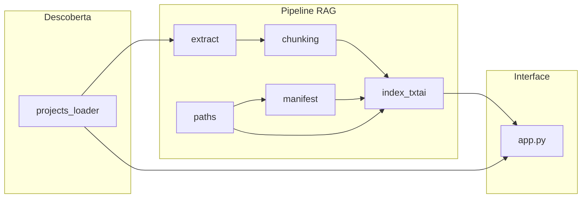

# Refatoração e Comentários — Plano

## Fluxo de dados (referência para os comentários)

## Princípios aplicados
- Comentários explicam o **porquê**, não o que o código faz
- Seções com `# ── Título ────────────────────────────` para navegação em arquivos longos
- Docstrings completos em funções públicas: propósito, parâmetros relevantes, comportamento em edge cases
- Sem comentários óbvios ("itera a lista", "retorna o resultado")

---

## Mudanças por arquivo

### [`apps/streamlit/rag/paths.py`](apps/streamlit/rag/paths.py) — pequenas adições
- Módulo docstring: explicar a cadeia de prioridade Docker → env var → fallback dev
- `txtai_data_root`: documentar que todas as funções do pacote `rag` dependem desta raiz
- `txtai_index_path`: explicar que é o diretório passado diretamente ao `Embeddings.save/load` do txtai
- `ensure_txtai_parent_exists`: explicar quando chamar (antes de `Embeddings.save`)

### [`apps/streamlit/rag/chunking.py`](apps/streamlit/rag/chunking.py) — adições médias
- Docstring completo: explicar o limite de 128 tokens do modelo e a relação com `max_chars`
- Comentar a lógica de `overlap` (janela deslizante que preserva contexto entre chunks)
- Comentar o guard de avanço forçado (`next_start <= start`)
- Comentar a busca por fronteira de palavra (`rfind` busca na segunda metade para evitar chunks muito curtos)

### [`apps/streamlit/rag/manifest.py`](apps/streamlit/rag/manifest.py) — adições médias
- Módulo docstring: explicar o papel do manifesto na indexação incremental (rastreio hash → chunks)
- Seções: `# ── Constantes e schema ──` / `# ── Estruturas de dados ──` / `# ── I/O em disco ──`
- `EXTRACTION_LOGIC_VERSION`: comentar quando incrementar e o efeito (força reprocessamento total)
- `IndexManifest`: docstring explicando os campos de controle de versão (`embedding_model`, `extraction_logic_version`, `chunking_signature`)
- `load_manifest`: comentar a migração de campo antigo (`content_hash` → `content_hash_sha256`)
- `chunking_signature`: explicar que mudança de parâmetros invalida o cache mesmo sem alteração de arquivo

### [`apps/streamlit/rag/extract.py`](apps/streamlit/rag/extract.py) — adições médias
- Módulo docstring: explicar o padrão roteador (dispatcher por sufixo) e política de tratamento de erro
- Seções: `# ── Roteador principal ──` / `# ── Helpers Word ──` / `# ── Extratores por formato ──`
- `extract_from_scanned_file`: documentar que erros de parsing são capturados para não interromper o pipeline
- `_iter_docx_blocks`: corrigir indentação da segunda linha do docstring (bug cosmético atual)
- `_table_row_cell_texts`: comentar por que usa `id(cell._tc)` (células de merge compartilham o mesmo `_tc`)
- `_extract_excel`: comentar o duplo mecanismo de truncagem (por linha e global)
- `_extract_plain`: comentar por que `latin-1` é o fallback seguro (cobre todos os 256 bytes)

### [`apps/streamlit/projects_loader.py`](apps/streamlit/projects_loader.py) — adições médias
- Módulo docstring: detalhar a convenção de volume (subpasta direta = `project_id`)
- Seções: `# ── Ambiente e configuração ──` / `# ── Estruturas de dados ──` / `# ── Varredura de arquivos ──` / `# ── Utilitários ──`
- `projetos_root_from_env`: documentar os três caminhos de resolução
- `scan_project`: adicionar docstring (atualmente ausente) explicando o que retorna e os parâmetros
- `_iter_files_recursive`: comentar os filtros de exclusão (`~$`, `.`)
- `compute_file_sha256`: explicar o streaming em blocos de 1 MB (evita carregar arquivo inteiro na RAM)
- `_file_sha256`: comentar que é wrapper interno para isolar o argumento `chunk_size` do escaneamento

### [`apps/streamlit/rag/index_txtai.py`](apps/streamlit/rag/index_txtai.py) — adições extensas (arquivo mais complexo)
- Módulo docstring: descrever os dois modos de indexação e a separação entre `build_index` (ponto de entrada) e as funções de busca
- Seções:
  - `# ── Configuração do modelo ──`
  - `# ── Tipos e estatísticas ──`
  - `# ── Helpers de preparação ──`
  - `# ── Operações no índice txtai ──`
  - `# ── Ponto de entrada: build_index ──`
  - `# ── Fluxo incremental ──`
  - `# ── Busca semântica ──`
  - `# ── Formatação de contexto para o LLM ──`
- `embeddings_config`: explicar `content=True` (armazena texto e metadados junto ao vetor — necessário para o chat com citações)
- `chunk_uid`: comentar por que SHA-256 determinístico é necessário (permite `delete` preciso no incremental)
- `BuildStats`: docstring de campos explicando o que conta como `reindexed` vs `skipped`
- `_upsert_rows_batched`: explicar o flag `use_initial_index` (primeiro lote usa `.index()`, demais usam `.upsert()` — exigência interna do txtai)
- `build_index`: expandir o docstring com o diagrama de decisão dos três caminhos
- `_build_index_incremental`: comentários detalhados no loop principal:
  - Por que `ids_to_delete` é preenchido **antes** de `rows_for_file` (garante remoção mesmo se arquivo virou vazio)
  - Por que o early-return sem `save_manifest` é seguro (só ocorre quando nada mudou)
  - A varredura de chaves removidas do disco (loop pós-arquivos)
- `format_context_for_llm`: comentar o limite de 12 000 chars e como o corte é sinalizado ao modelo

### [`apps/streamlit/rag/__init__.py`](apps/streamlit/rag/__init__.py) — pequenas adições
- Módulo docstring: listar os três subsistemas exportados (indexação, busca, formatação) e onde cada um é consumido

### [`apps/streamlit/app.py`](apps/streamlit/app.py) — adições extensas (maior arquivo)
- Seções:
  - `# ── System prompt ──`
  - `# ── Helpers de configuração e conexão ──`
  - `# ── Cache do backend txtai ──`
  - `# ── Barra lateral ──`
  - `# ── Abas da UI ──`
  - `# ── Ponto de entrada ──`
- `_normalize_openai_base_url`: comentar que o SDK OpenAI exige o sufixo `/v1`
- `_txtai_backend_cached`: explicar a estratégia `mtime_key` (o parâmetro é o gatilho de invalidação do `st.cache_resource`)
- `rag_semantic_search`: comentar a separação entre "carregar modelo" (cacheado) e "executar busca" (por chamada)
- `_trim_chat_history`: comentar a aritmética turnos × 2 e o risco sem truncagem
- `_tab_indexacao_rag`: comentar o `replace_default = not index_ready()` (desmarca automaticamente após 1ª indexação)
- `_tab_chat`: comentar a injeção de contexto RAG no system prompt (não na mensagem do usuário) e por que a última mensagem do usuário é removida do histórico em caso de erro

## Abordagem de implementação
- Usar `StrReplace` para inserir seções e comentários nos pontos exatos
- Começar pelos arquivos menores (`paths.py`, `__init__.py`, `chunking.py`) e avançar para os maiores (`index_txtai.py`, `app.py`)
- Validar lints após cada arquivo
