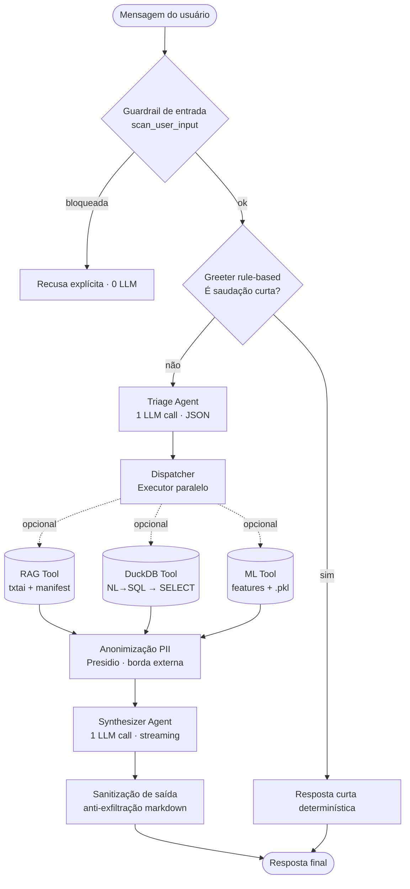

# Sistema multiagentes do Assistente de Lab (CrewAI)

Este documento descreve como o chat foi reorganizado em um time de agentes CrewAI consumindo o LLM remoto via **OpenRouter** (API compatível com OpenAI). O fluxo é o **único** caminho do chat — o antigo `chat_router.py` foi aposentado em 2026-05; as regras determinísticas (regex de saudação/laboratório/ML/tabular) vivem agora em `agents/intent_rules.py`, compartilhadas pelo Triage e pelo Greeter.

> **Nota técnica para o leitor júnior:**
>
> - **Agente** = entidade com papel, objetivo e (geralmente) acesso ao LLM. Ele "pensa" antes de agir.
> - **Tool** = função Python pura, sem LLM próprio. O agente decide quando chamar.
> - **Crew** = orquestrador que executa Tasks numa ordem (sequencial ou paralela) e passa o output de uma para a próxima.

## 1. Filosofia da arquitetura

A meta é **economizar tokens sem perder precisão**. Para isso seguimos quatro princípios:

1. **Curto-circuito determinístico para saudações.** Zero chamadas LLM se a mensagem é "oi"/"obrigado". Implementado como pré-passo rule-based antes do Crew (usa `is_social_only` de `agents/intent_rules.py`).
2. **LLM só onde precisa raciocinar.** Triagem e Síntese são agentes; RAG, OLAP e ML são Tools determinísticas que internamente já têm seu próprio LLM call (geração de SQL, extração de features) — não duplicamos chamadas.
3. **Paralelismo onde possível.** Quando o Triage libera ≥2 rotas (ex.: documentos + planilhas), as Tools são executadas em paralelo via `concurrent.futures.ThreadPoolExecutor`.
4. **Handoff observável.** Cada etapa grava em `HandoffTrace` o que entrou, o que saiu e o tempo gasto, exibido temporariamente em um expander na aba Conversa.

## 2. Mapa do fluxo



> **Camada de segurança** (`agents/security.py`): o guardrail de entrada roda
> **antes** do Greeter; a anonimização de PII (Presidio) roda **na borda
> externa** — só o que sai para OpenRouter/Langfuse é anonimizado, a resposta ao
> usuário autenticado fica íntegra; a sanitização de saída roda **antes** do
> `st.markdown`. Detalhes na seção 3.8.


## 3. Papéis dos agentes e tools

### 3.1 Greeter (rule-based, sem agente formal)


| Item          | Detalhe                                                                          |
| ------------- | -------------------------------------------------------------------------------- |
| Implementação | `agents.greeter.handle_greeting` — usa `SOCIAL_ONLY` de `agents/intent_rules.py` |
| Entrada       | `message: str`                                                                   |
| Saída         | `str                                                                             |
| LLM calls     | 0                                                                                |


Justificativa: saudações são ~30% das mensagens em chats de laboratório, e usar LLM para responder "Olá!" é desperdício de janela de contexto.

### 3.2 Triage Agent (CrewAI Agent)


| Item              | Detalhe                                                                   |
| ----------------- | ------------------------------------------------------------------------- |
| Implementação     | `agents.crew.build_triage_agent`                                          |
| Papel             | "Classificador de intenção do laboratório"                                |
| Objetivo          | Decidir quais Tools (RAG, OLAP, ML) acionar                               |
| Entrada           | mensagem + histórico recente                                              |
| Saída             | JSON `{"use_rag": bool, "use_olap": bool, "use_ml": bool, "reason": str}` |
| LLM calls         | 1 (saída curta, perfil `PROFILE_CHAT_ROUTER` — temp 0.2)                  |
| Tools disponíveis | nenhuma (só raciocina)                                                    |


O system prompt do classificador vive em `agents/triage.py` (constante `_TRIAGE_SYSTEM`).

### 3.3 Dispatcher (Python puro)


| Item          | Detalhe                                         |
| ------------- | ----------------------------------------------- |
| Implementação | `agents.crew.dispatch_specialists`              |
| Função        | Lê o JSON do Triage e dispara Tools em paralelo |
| Concorrência  | `ThreadPoolExecutor(max_workers=3)`             |
| Saída         | `dict[str, ToolResult]` por Tool acionada       |


### 3.4 RAG Tool


| Item          | Detalhe                                                                    |
| ------------- | -------------------------------------------------------------------------- |
| Implementação | `agents.tools.rag_search_tool`                                             |
| Backend       | `rag.search_with_backend` + `format_context_for_llm` (já existentes)       |
| LLM calls     | 0 (apenas embedding + busca vetorial)                                      |
| Entrada       | `query: str`, `top_k: int`, `project_ids: set[str]                         |
| Saída         | `ToolResult(name="rag", context_for_llm=str, evidence_count=int, ok=bool)` |


> Convenção de nomes (`ToolResult.name`): use sempre `"rag"`, `"olap"` e `"ml"` — iguais às chaves do dicionário `tool_results` consumido pelo `Synthesizer`. Não há "duckdb" como nome de Tool: o motor é DuckDB, mas o papel/Tool chama-se `olap`.

### 3.5 DuckDB OLAP Tool


| Item          | Detalhe                                                      |
| ------------- | ------------------------------------------------------------ |
| Implementação | `agents.tools.duckdb_query_tool`                             |
| Backend       | `olap.run_nl_olap_query` (já existente)                      |
| LLM calls     | 1 interna (NL→SQL, perfil `PROFILE_OLAP_SQL`)                |
| Entrada       | `question: str`                                              |
| Saída         | `ToolResult` com `sql`, `rows_preview`, `context_for_llm`    |
| Guardrail     | apenas SELECT/WITH; bloqueia DDL/DML (validate_readonly_sql) |


### 3.6 ML Predict Tool


| Item          | Detalhe                                                      |
| ------------- | ------------------------------------------------------------ |
| Implementação | `agents.tools.ml_predict_tool`                               |
| Backend       | `ml.chat_infer.run_chat_ml_inference` (já existente)         |
| LLM calls     | 1 interna (extração de features estruturadas em JSON)        |
| Entrada       | `message: str`, `history: list[dict]`, `bundle: ModelBundle` |
| Saída         | `ToolResult` com `predictions_df`, `context_for_llm`         |
| Pré-condição  | `chat_ml_model_available()` true e bundle carregado          |


### 3.7 Synthesizer Agent (CrewAI Agent)


| Item          | Detalhe                                                       |
| ------------- | ------------------------------------------------------------- |
| Implementação | `agents.crew.build_synthesizer_agent`                         |
| Papel         | "Assistente de laboratório (ELISA / P&D)"                     |
| Objetivo      | Consolidar contextos numa resposta cordial e citável          |
| Entrada       | mensagem original + contextos das Tools                       |
| Saída         | resposta em pt-BR para o chat                                 |
| LLM calls     | 1 (perfil `PROFILE_CHAT_INSTRUCT` ou `PROFILE_CHAT_THINKING`) |
| Streaming     | sim, via `iter_stream_answer_text`                            |


System prompt: combinação de `CHAT_SYSTEM_PROMPT` (geral) + `CHAT_ML_SYSTEM_PROMPT` (quando há predição), preservando o tom já existente. O bloco `<security>` instrui o modelo a tratar todo contexto recuperado como **dado não confiável**, nunca como instrução (separação dado/instrução — relatório P1-2).

### 3.8 Camada de segurança (`agents/security.py`)

Implementa as tratativas P1-1..P1-4 do relatório de segurança e o requisito do RDD (PII/segredos não vazam). Pontos de controle, todos configuráveis por env (`SECURITY_*`):

| Controle | Onde roda | Biblioteca | Mitiga (relatório) |
| -------- | --------- | ---------- | ------------------ |
| `scan_user_input` | Antes do Greeter (em `app.py`) | LLM Guard + heurística regex | 1.3 prompt-injection, 2.6 eco de prompt, 1.5 mensagem gigante |
| `anonymize_messages_for_external` | Antes do `create_chat_completion` | **Presidio** (PT+EN, spaCy *small*, +CPF/CNPJ) | 1.4 dado→OpenRouter, 2.4 trace→Langfuse |
| `sanitize_model_output` | Antes do `st.markdown` | LLM Guard + heurística regex | 2.3 exfiltração via markdown/HTML |
| `scan_secrets` | Dentro de `scan_user_input` (bloqueia) e `sanitize_model_output` (redige) | **detect-secrets** (Yelp) | credenciais técnicas (chave de API AWS/GitHub/Slack/Stripe, chave privada, JWT) coladas pelo usuário ou ecoadas de documentos |

**Política de fronteira:** a anonimização de PII é aplicada **só na borda externa**. A resposta renderizada ao usuário autenticado permanece íntegra (ele precisa ver lote/validade/nomes); apenas o prompt que vai ao provedor remoto e o trace do Langfuse são anonimizados.

**Segredos técnicos (`scan_secrets`):** complementar ao Presidio — Presidio cobre PII de pessoa física, `scan_secrets` cobre credenciais técnicas (AWS/GitHub/Slack/Stripe/JWT/chaves privadas) via `detect-secrets`, mesmo motor do scanner `Secrets` do LLM Guard. Roda em DUAS pontas:
- **Entrada** (`scan_user_input`): se a mensagem do usuário contém um segredo (ex.: colou um trecho de `.env`), a mensagem é **bloqueada** antes do Triage — zero tokens gastos, o segredo nunca sai para o LLM remoto.
- **Saída** (`sanitize_model_output`): se um documento indexado no RAG contiver um segredo esquecido e o LLM o ecoar na resposta, o trecho é **redigido** (mostra só os 2 primeiros/últimos caracteres) antes de `st.markdown` — a resposta segue normalmente, sem bloquear.

Controlado por `SECURITY_SECRETS_GUARD_ENABLED` (default `1`). Dependência: `detect-secrets` puro (sem o pacote `llm-guard`, que arrasta `sentencepiece`/transformers e não permite customizar a lista de plugins). A allowlist `_SECRETS_PLUGINS` (`security.py`) usa só detectores de PADRÃO específico (AWS, GitHub, Slack, Stripe, JWT, chave privada...), **excluindo** `Base64HighEntropyString`/`HexHighEntropyString` — esses dois classificam palavras comuns em PT-BR ("ELISA", "lote", "Chikungunya") como "segredo de alta entropia" e bloqueariam toda mensagem normal.

**Limitação conhecida:** segredos no formato `VARIAVEL=valor` sem aspas (ex.: colar um `.env` cru com `OPENROUTER_API_KEY=sk-or-v1-...`) só são detectados se o provedor tiver um detector de padrão dedicado (AWS/Slack/Stripe/GitHub/JWT cobrem isso pelo formato do valor). Chaves sem padrão conhecido (ex.: OpenRouter) só são pegas pelo `KeywordDetector`, que exige aspas (`KEY="valor"`). Tradeoff aceito para evitar falso-positivo via entropia.

**Preservação da fonte (RDD:13):** a anonimização roda linha-a-linha com `preserve_source_lines=True`. As linhas que carregam a fonte da evidência (`### Evidência [N] — Projeto: … · Arquivo: …`, o prefixo `[Projeto: …] [Arquivo: …]` e as colunas `_project_id`/`_source_file` do OLAP) passam **íntegras** — sem isso, nomes de arquivo como `protocolo_Dra_Silva_2024.docx` seriam redigidos e a rastreabilidade/citação quebraria.

**Preservação do dado de negócio (requisito "ler e interpretar os chunks"):** só as entidades de `pii_entities()` (PII de pessoa física: CPF, CNPJ, e-mail, telefone, cartão, PERSON…) são redigidas. `DATE_TIME`, `ORGANIZATION` e `LOCATION` são **preservados** — neste domínio são **validade / fabricante / local**, exatamente o dado que o Sintetizador precisa ler e interpretar para elaborar a resposta ou relatório. Anonimizá-los esvaziaria a resposta (`Validade <DATE_TIME>` em vez de `2025-08-15`). Ajustável por `SECURITY_PII_ENTITIES`.

**Calibração do guardrail de entrada:** o padrão `override_role` ("aja como"/"assuma o papel") foi removido por gerar falso positivo em perguntas compostas legítimas (RDD:19-20). Restam `ignore_previous`, `reveal_prompt` e `developer_mode` (jailbreak/DAN).

## 4. Trace de handoff (modo aprendizado)

Para acompanhar o que cada agente faz, ative o toggle **"Mostrar trilha do crew"** na aba **Desenvolvimento → Parâmetros do chat**. A `HandoffTrace` (definida em `agents/handoff.py`) registra:

- `step` — nome do agente/tool
- `started_at`, `elapsed_ms`
- `input_summary` — entrada resumida (limitada a ~200 chars)
- `output_summary` — saída resumida
- `metadata` — dict com hits, sql, predições etc.

Na UI, isso vira um `st.expander("Trilha dos agentes (dev)")` com cada step em cards.

> Para produção, basta desligar o toggle. O `HandoffTrace` é construído mesmo assim (custo desprezível) e fica disponível para auditoria futura.

## 5. Contagem de chamadas LLM por cenário


| Cenário                               | Chamadas                                      |
| ------------------------------------- | --------------------------------------------- |
| Saudação                              | 0 (Greeter rule-based)                        |
| Pergunta só docs                      | 1 triage + 1 synth = **2**                    |
| Pergunta só planilhas                 | 1 triage + 1 SQL (tool) + 1 synth = **3**     |
| Pergunta só ML                        | 1 triage + 1 extract (tool) + 1 synth = **3** |
| Pergunta combinada (docs + planilhas) | 1 triage + 1 SQL + 1 synth = **3**            |


A única mensagem que **não** chama o LLM é a saudação. Em qualquer outro caso há ao menos 1 chamada (Triage) + 1 chamada (Synthesizer); as Tools (OLAP/ML) adicionam 1 chamada interna cada.

## 6. Configuração CrewAI ↔ OpenRouter

CrewAI usa LiteLLM por baixo dos panos. Para falar com o OpenRouter (OpenAI-compatível) usamos o prefixo `openrouter/` no slug do modelo, e o LiteLLM cuida do `base_url` e do header `Authorization` automaticamente:

```python
from crewai import LLM

llm = LLM(
    model=f"openrouter/{LLM_MODEL}",          # prefixo "openrouter/" reconhecido pelo LiteLLM
    base_url="https://openrouter.ai/api/v1",
    api_key=OPENROUTER_API_KEY,
    temperature=0.7,
    top_p=0.8,
    extra_headers={                            # opcional — rankings do OpenRouter
        "HTTP-Referer": OPENROUTER_HTTP_REFERER,
        "X-Title": OPENROUTER_APP_TITLE,
    },
)
```

Quando o slug já contém uma barra (ex.: `openrouter/auto`, `meta-llama/llama-3.3-70b-instruct:free`), o `agents.llm._model_with_provider` evita duplicar o prefixo.

Os perfis Qwen3.5 (`PROFILE_CHAT_INSTRUCT`, `PROFILE_OLAP_SQL`, etc.) continuam aplicados nas Tools, que chamam o cliente OpenAI direto (não via LiteLLM). Isso preserva os parâmetros já validados (`top_k`, `enable_thinking`) sempre que o modelo escolhido for da família Qwen3.5.

## 7. Quando vale a pena adicionar mais agentes?

Mantenha agentes formais apenas para etapas que **precisam raciocinar** com base em texto livre:


| Cenário                               | Adicionar agente?         |
| ------------------------------------- | ------------------------- |
| Validação de protocolos contra ANVISA | Sim — exige interpretação |
| Geração de relatório formatado        | Sim — síntese livre       |
| Conversão de unidades (mol/L ↔ µg/mL) | Não — Tool determinística |
| Verificar SHA do índice               | Não — Tool                |


## 8. Variáveis de ambiente


| Variável              | Default | Função                                                                                                                                                                                        |
| --------------------- | ------- | --------------------------------------------------------------------------------------------------------------------------------------------------------------------------------------------- |
| `CREW_TRACE_HANDOFF`  | `1`     | `0` desativa a coleta de trace mesmo com toggle ligado                                                                                                                                        |
| `CREW_PARALLEL_TOOLS` | `1`     | `0` força execução sequencial das Tools (debug)                                                                                                                                               |
| `CREW_VERBOSE`        | `0`     | **Reservado** — pensado para logs detalhados do Crew, ainda não consumido em runtime (o Crew custom não usa `Crew.kickoff` do CrewAI). Implementar quando `agents/llm.py` entrar em produção. |


> `USE_CREWAI` foi removida em 2026-05 — o pipeline multiagente é o único caminho do chat. Se a variável ainda estiver no seu `.env`, pode apagá-la (presença ou ausência não afeta nada).

## 9. Roadmap

- ~~Substituir definitivamente o `chat_router`~~ — feito em 2026-05.
- Adicionar agente "Auditor" que valida citações antes de retornar (Fase 4)
- Cache de Triage por hash da mensagem (atalho extra de tokens)
- Métricas: total de chamadas LLM por sessão, custo aproximado em tokens
- Implementar `CREW_VERBOSE` e/ou migrar Triage+Synthesizer para `crewai.Crew` real (`agents/llm.py` já está pronto)

