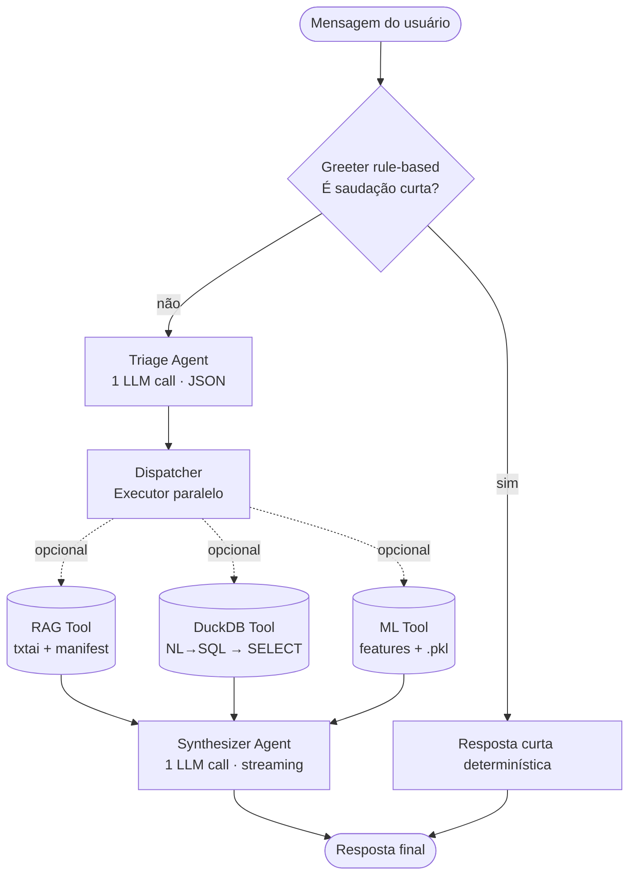

# Sistema multiagentes do Assistente de Lab (CrewAI local)

Este documento descreve como o chat foi reorganizado em um time de agentes CrewAI rodando inteiramente em local com LM Studio. O fluxo substitui o `chat_router.py` monolítico por um Crew com responsabilidades claras, fácil de auditar e estender.

> **Nota técnica para o leitor júnior:**
> - **Agente** = entidade com papel, objetivo e (geralmente) acesso ao LLM. Ele "pensa" antes de agir.
> - **Tool** = função Python pura, sem LLM próprio. O agente decide quando chamar.
> - **Crew** = orquestrador que executa Tasks numa ordem (sequencial ou paralela) e passa o output de uma para a próxima.

## 1. Filosofia da arquitetura

A meta é **economizar tokens sem perder precisão**. Para isso seguimos quatro princípios:

1. **Curto-circuito determinístico para saudações.** Zero chamadas LLM se a mensagem é "oi"/"obrigado". Implementado como pré-passo rule-based antes do Crew (reaproveita `_is_social_only` do `chat_router.py`).
2. **LLM só onde precisa raciocinar.** Triagem e Síntese são agentes; RAG, OLAP e ML são Tools determinísticas que internamente já têm seu próprio LLM call (geração de SQL, extração de features) — não duplicamos chamadas.
3. **Paralelismo onde possível.** Quando o Triage libera ≥2 rotas (ex.: documentos + planilhas), as Tools são executadas em paralelo via `concurrent.futures.ThreadPoolExecutor`.
4. **Handoff observável.** Cada etapa grava em `HandoffTrace` o que entrou, o que saiu e o tempo gasto, exibido temporariamente em um expander na aba Conversa.

## 2. Mapa do fluxo



## 3. Papéis dos agentes e tools

### 3.1 Greeter (rule-based, sem agente formal)

| Item | Detalhe |
|------|---------|
| Implementação | `agents.greeter.handle_greeting` — usa `_SOCIAL_ONLY` de `chat_router.py` |
| Entrada | `message: str` |
| Saída | `str | None` (None se não é saudação; texto curto se for) |
| LLM calls | 0 |

Justificativa: saudações são ~30% das mensagens em chats de laboratório, e usar LLM para responder "Olá!" é desperdício de janela de contexto.

### 3.2 Triage Agent (CrewAI Agent)

| Item | Detalhe |
|------|---------|
| Implementação | `agents.crew.build_triage_agent` |
| Papel | "Classificador de intenção do laboratório" |
| Objetivo | Decidir quais Tools (RAG, OLAP, ML) acionar |
| Entrada | mensagem + histórico recente |
| Saída | JSON `{"use_rag": bool, "use_olap": bool, "use_ml": bool, "reason": str}` |
| LLM calls | 1 (saída curta, perfil `PROFILE_CHAT_ROUTER` — temp 0.2) |
| Tools disponíveis | nenhuma (só raciocina) |

Reutiliza o system prompt de `chat_router._ROUTER_SYSTEM`, ajustado para o protocolo CrewAI.

### 3.3 Dispatcher (Python puro)

| Item | Detalhe |
|------|---------|
| Implementação | `agents.crew.dispatch_specialists` |
| Função | Lê o JSON do Triage e dispara Tools em paralelo |
| Concorrência | `ThreadPoolExecutor(max_workers=3)` |
| Saída | `dict[str, ToolResult]` por Tool acionada |

### 3.4 RAG Tool

| Item | Detalhe |
|------|---------|
| Implementação | `agents.tools.rag_search_tool` |
| Backend | `rag.search_with_backend` + `format_context_for_llm` (já existentes) |
| LLM calls | 0 (apenas embedding + busca vetorial) |
| Entrada | `query: str`, `top_k: int`, `project_ids: set[str] | None` |
| Saída | `ToolResult(name="rag", context_for_llm=str, evidence_count=int, ok=bool)` |

### 3.5 DuckDB OLAP Tool

| Item | Detalhe |
|------|---------|
| Implementação | `agents.tools.duckdb_query_tool` |
| Backend | `olap.run_nl_olap_query` (já existente) |
| LLM calls | 1 interna (NL→SQL, perfil `PROFILE_OLAP_SQL`) |
| Entrada | `question: str` |
| Saída | `ToolResult` com `sql`, `rows_preview`, `context_for_llm` |
| Guardrail | apenas SELECT/WITH; bloqueia DDL/DML (validate_readonly_sql) |

### 3.6 ML Predict Tool

| Item | Detalhe |
|------|---------|
| Implementação | `agents.tools.ml_predict_tool` |
| Backend | `ml.chat_infer.run_chat_ml_inference` (já existente) |
| LLM calls | 1 interna (extração de features estruturadas em JSON) |
| Entrada | `message: str`, `history: list[dict]`, `bundle: ModelBundle` |
| Saída | `ToolResult` com `predictions_df`, `context_for_llm` |
| Pré-condição | `chat_ml_model_available()` true e bundle carregado |

### 3.7 Synthesizer Agent (CrewAI Agent)

| Item | Detalhe |
|------|---------|
| Implementação | `agents.crew.build_synthesizer_agent` |
| Papel | "Assistente de laboratório (ELISA / P&D)" |
| Objetivo | Consolidar contextos numa resposta cordial e citável |
| Entrada | mensagem original + contextos das Tools |
| Saída | resposta em pt-BR para o chat |
| LLM calls | 1 (perfil `PROFILE_CHAT_INSTRUCT` ou `PROFILE_CHAT_THINKING`) |
| Streaming | sim, via `iter_stream_answer_text` |

System prompt: combinação de `CHAT_SYSTEM_PROMPT` (geral) + `CHAT_ML_SYSTEM_PROMPT` (quando há predição), preservando o tom já existente.

## 4. Trace de handoff (modo aprendizado)

Para acompanhar o que cada agente faz, ative o toggle **"Mostrar trilha do crew"** na aba **Desenvolvimento → Parâmetros do chat**. A `HandoffTrace` (definida em `agents/handoff.py`) registra:

- `step` — nome do agente/tool
- `started_at`, `elapsed_ms`
- `input_summary` — entrada resumida (limitada a ~200 chars)
- `output_summary` — saída resumida
- `metadata` — dict com hits, sql, predições etc.

Na UI, isso vira um `st.expander("Trilha dos agentes (dev)")` com cada step em cards.

> Para produção, basta desligar o toggle. O `HandoffTrace` é construído mesmo assim (custo desprezível) e fica disponível para auditoria futura.

## 5. Contagem estimada de chamadas LLM

| Cenário | Atual (chat_router) | Crew |
|---------|---------------------|------|
| Saudação | 0 (rule-based) | 0 (Greeter) |
| Pergunta só docs | 1 router + 1 chat = **2** | 1 triage + 1 synth = **2** |
| Pergunta só planilhas | 1 router + 1 SQL + 1 chat = **3** | 1 triage + 1 SQL (tool) + 1 synth = **3** |
| Pergunta só ML | 1 router + 1 extract + 1 chat = **3** | 1 triage + 1 extract (tool) + 1 synth = **3** |
| Pergunta combinada (docs + planilhas) | 1 + 1 + 1 = **3** | 1 + 1 + 1 = **3** |

Em todos os cenários, o número de chamadas LLM **não aumenta**. O ganho real é em **clareza, manutenção e rastreabilidade**.

## 6. Configuração CrewAI ↔ LM Studio

CrewAI usa LiteLLM por baixo dos panos. Para falar com o LM Studio (OpenAI-compatível) usamos:

```python
from crewai import LLM

llm = LLM(
    model=f"openai/{LLM_MODEL}",   # prefixo "openai/" obrigatório no LiteLLM
    base_url="http://192.168.15.7:1234/v1",
    api_key="lm-studio",
    temperature=0.7,
    top_p=0.8,
)
```

Os perfis Qwen3.5 (`PROFILE_CHAT_INSTRUCT`, `PROFILE_OLAP_SQL`, etc.) continuam aplicados nas Tools, que chamam o cliente OpenAI direto (não via LiteLLM). Isso preserva os parâmetros já validados (top_k, enable_thinking).

## 7. Quando vale a pena adicionar mais agentes?

Mantenha agentes formais apenas para etapas que **precisam raciocinar** com base em texto livre:

| Cenário | Adicionar agente? |
|---------|-------------------|
| Validação de protocolos contra ANVISA | Sim — exige interpretação |
| Geração de relatório formatado | Sim — síntese livre |
| Conversão de unidades (mol/L ↔ µg/mL) | Não — Tool determinística |
| Verificar SHA do índice | Não — Tool |

## 8. Variáveis de ambiente

| Variável | Default | Função |
|----------|---------|--------|
| `USE_CREWAI` | `0` | `1`/`true` ativa o Crew; senão usa o `chat_router` legado |
| `CREW_VERBOSE` | `0` | `1` liga logs detalhados do Crew (stdout do contêiner) |
| `CREW_TRACE_HANDOFF` | `1` | `0` desativa a coleta de trace mesmo com toggle ligado |
| `CREW_PARALLEL_TOOLS` | `1` | `0` força execução sequencial das Tools (debug) |

## 9. Roadmap

- [ ] Substituir definitivamente o `chat_router` quando o Crew estiver estável (~2 sprints)
- [ ] Adicionar agente "Auditor" que valida citações antes de retornar (Fase 4)
- [ ] Cache de Triage por hash da mensagem (atalho extra de tokens)
- [ ] Métricas: total de chamadas LLM por sessão, custo aproximado em tokens
